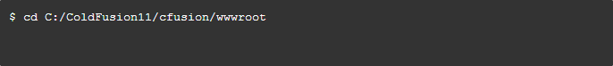

# Contribuindo para Phoenix Project

 - [Fork px-project](#fork)
 - [Clonar px-project](#clone)
 - [Upstream](#upstream)
 - [Pull Request](#pullrequest)
 - [Pull Request Aceito](#merged)
 - [Commit Message (Formato)](#commit)
 

## <a name="fork"></a> Fork px-project

Faça um fork (clicando no botão **Fork**) do repositório oficial [Phoenix Project](https://github.com/wesleifreitas/px-project)

## <a name="clone"></a> Clonar px-project

* Execute o Git Bash
* Navegue até a pasta ColdFusion11/cfusion/wwwroot:



* Execute o comando git clone para clonar px-project do seu respositório

```shell
git clone git@github.com:YOUR-GITHUB-USERNAME/px-project.git
```

## <a name="upstream"></a> Upstream

* Acesse a pasta do projeto px-project clonado:

```shell
cd px-project
```

* Crie um git remote chamdo **upstream** do repositório oficial:

```shell
git remote add upstream git@github.com:wesleifreitas/px-project.git
```

## <a name="pullrequest"></a> Pull Request

* Faça suas alterações em um novo git branch:

```shell
git checkout -b my-fix-branch master
```

* Após desenvolver e testar suas alterações ralize o commit:

```shell
git commit -a
```
* Envie seu branch para o GitHub

```shell
git push origin my-fix-branch
```
* Acesse seu respositório no site GitHub e envie um Pull Request para o projeto oficial

## <a name="merged"></a> Pull Request aceito

Depois que seu Pull Request for aceito (merged), o branch pode ser removido com segurança e suas alterações devem ser atualizadas do repositório oficial (upstream):


* Remover branch remote:

```shell
git push origin --delete my-fix-branch
```

* Checkout no branch master:

```shell
git checkout master -f
```

* Remover o branch local:

```shell
git branch -D my-fix-branch
```

* Atualizar seu branch master com a última versão (upstream)

```shell
git pull --ff upstream master
```

## <a name="commit"></a> Git Commit

Regras para o commit.

### <a name="commit"></a>Commit Message (Formato)
Cada mensagem de commit possui um **header**(obrigatório), um **body** e um **footer**.  O header incluir um **type**(obrigatório), um **scope**(obrigatório) e um **subject**(obrigatório):

```
<type>(<scope>): <subject>
<BLANK LINE>
<body>
<BLANK LINE>
<footer>
```

### Type
Deve ser um destes:

* **feat**: Um novo recurso
* **fix**: Uma correção de bug
* **docs**: Mudanças referentes a documentação
* **style**: Alterações que não afetam o código (espaço em branco, formatação, falta de ponto e vírgula, etc)
* **refactor**: Melhoria de código que não corrige um bug e nem adiciona um novo recurso
* **perf**: Alteração no código que melhora o desempenho

### Scope
O escopo pode ser qualquer coisa especificando o que o commit está alterando. Por exemplo `login`,
`px-grid`, `px-form`, etc...

### Subject
Descrição objetiva da mudança:

* use frases no presente e modo imperativo: "alterar" e não "alterado" nem "alterações", por exemplo: `alterar o formulário de login`
* não utilize letra maiúsculas na primeira letra
* não inclua o ponto no final no título

###Body
Assim como o **subject**, utilize frases no presente e modo imperativo.
O body pode descrever a motivação da alteração e comparar seu comportamente com a anterior.

###Footer
Considerações finais.
