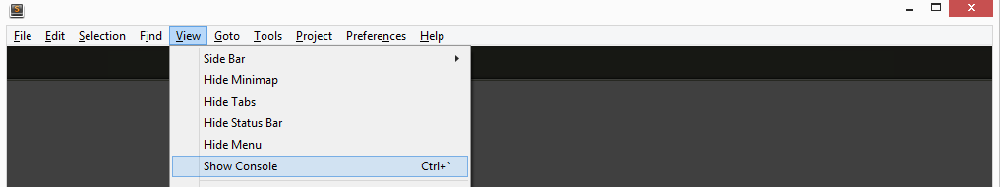
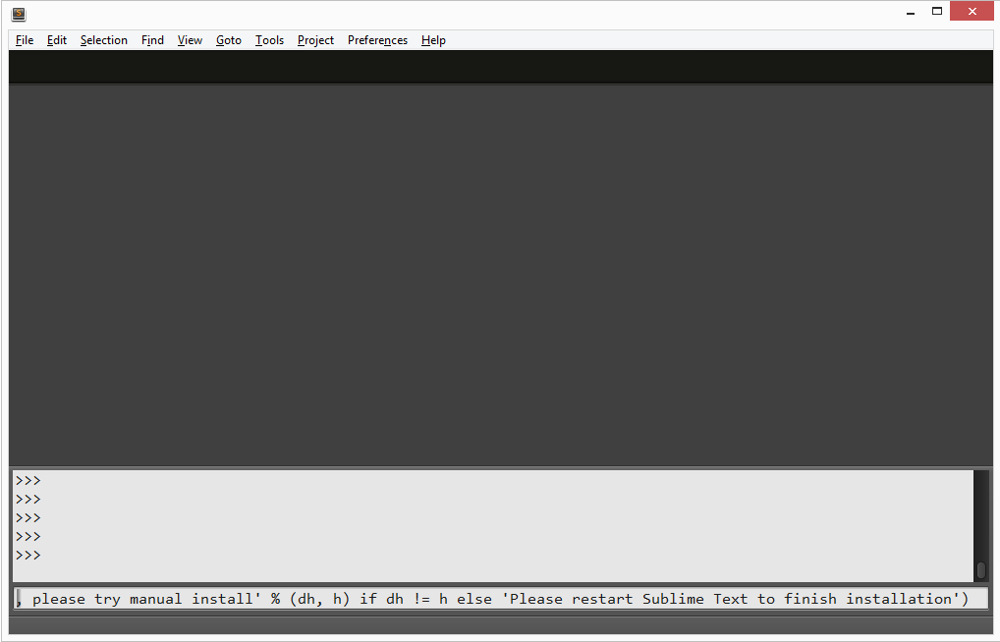
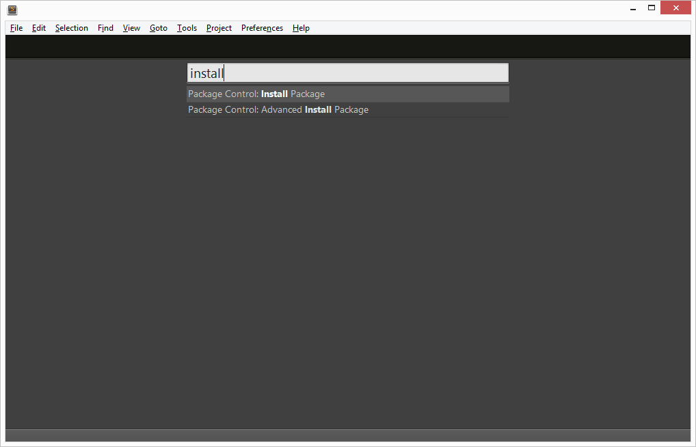

# Sublime - Ajustes Importantes

Para facilitar o desenvolvimento utilizando **Sublime Text 2** siga os passos a seguir (Abra o Sublime Text 2).

## Package Control

Instale o gerenciador de pacotes seguindo as instruções no endereço https://sublime.wbond.net/installation#st2 ou siga os passos a seguir.

* Acesse **View** - **Show Console**

* Cole o texto a seguir no campo inferior do console.

>import urllib2,os,hashlib; h = '7183a2d3e96f11eeadd761d777e62404' + 'e330c659d4bb41d3bdf022e94cab3cd0'; pf = 'Package Control.sublime-package'; ipp = sublime.installed_packages_path(); os.makedirs( ipp ) if not os.path.exists(ipp) else None; urllib2.install_opener( urllib2.build_opener( urllib2.ProxyHandler()) ); by = urllib2.urlopen( 'http://sublime.wbond.net/' + pf.replace(' ', '%20')).read(); dh = hashlib.sha256(by).hexdigest(); open( os.path.join( ipp, pf), 'wb' ).write(by) if dh == h else None; print('Error validating download (got %s instead of %s), please try manual install' % (dh, h) if dh != h else 'Please restart Sublime Text to finish installation') 

* Para concluir tecle **Enter** e reinicie o Sublime.
	
## Instalando Pacotes

Para instalar pacotes no sublime vá em **Tools** - **Command Palette** ou use as teclas de atalho *Ctrl+Shift+P* (Windows). Procure comando **Package Control: Install Package**, repare que é possível digitar apenas uma parte do comando.

Aperte a tecla **Enter**. Neste momento o sublime irá buscar em seu repositório os pacotes disponíveis.
Para instalar digite o *Nome* do package desejado e tecle **Enter**, abaixo lista dos pacotes sugeridos.

Nome         | Detalhes (Veja como funciona o *plugin*)
------------ | -------------
Autoprefixer | https://github.com/sindresorhus/sublime-autoprefixer 
ColdFusion | https://github.com/SublimeText/ColdFusion
ColorPicker | https://sublime.wbond.net/packages/ColorPicker
CSS Format | https://sublime.wbond.net/packages/CSS%20Format 
DocBlockr | https://github.com/spadgos/sublime-jsdocs
HTML-CSS-JS Prettify | https://github.com/victorporof/Sublime-HTMLPrettify 
jQuery | https://sublime.wbond.net/packages/jQuery
JsFormat | https://github.com/jdc0589/JsFormat

## Adicionar projeto no Sublime Text

Por fim para adicionar uma pasta de projeto no Sublime Text vá em **Project** - **Add Folder to Project...**
