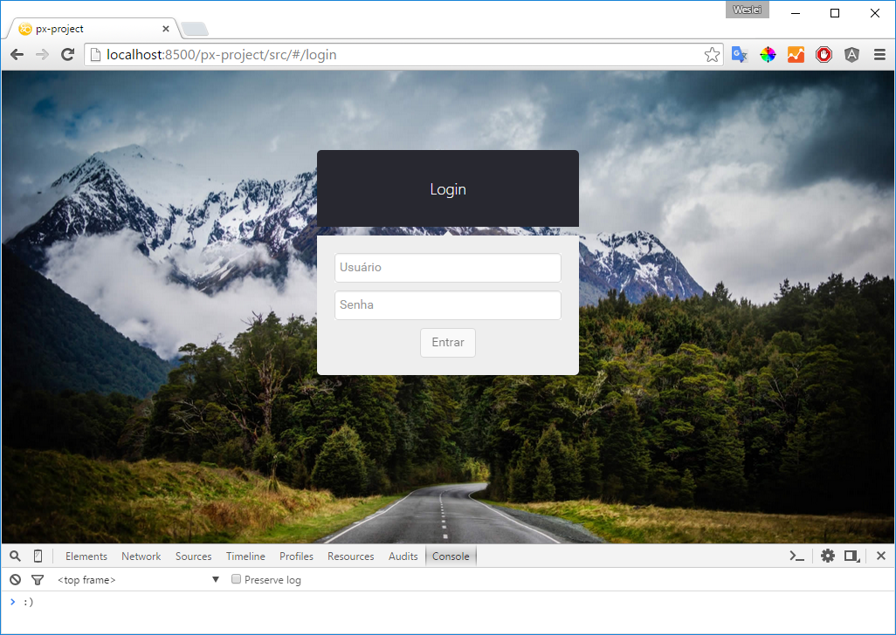
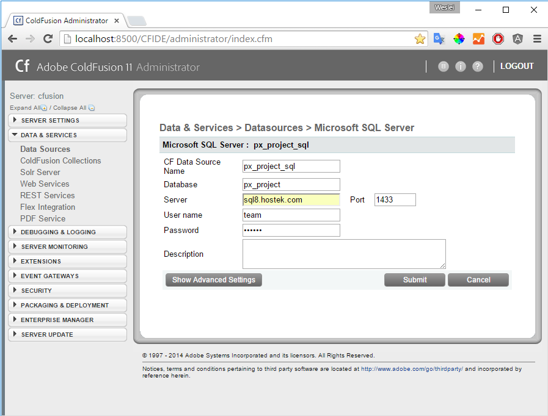

# px-example

Para acessar o projeto de exemplo acesse no navegador o seguinte endereço: [http://localhost:8500/px-example](http://localhost:8500/px-example)

Antes de realizar o login no sistema, o **DSN (ColdFusion)** deve ser configurado, então acesse: 
[http://localhost:8500/CFIDE/administrator](http://localhost:8500/CFIDE/administrator); Na seção **DATA & SERVICES** - **Data Sources**, crie uma nova conexão.

Parâmetro | Valor
------------ | -------------
CF Data Source Name | px_project_sql
Database | px_project
Server | sql7.hostek.com | Port: 1433
User name | team
Password | Px2015

Com a conexão definida, vá endereço [http://localhost:8500/px-example](http://localhost:8500/px-example) e realize o login:

Campo | Valor
------------ | -------------
Usuário | px-project
Senha | atopng
